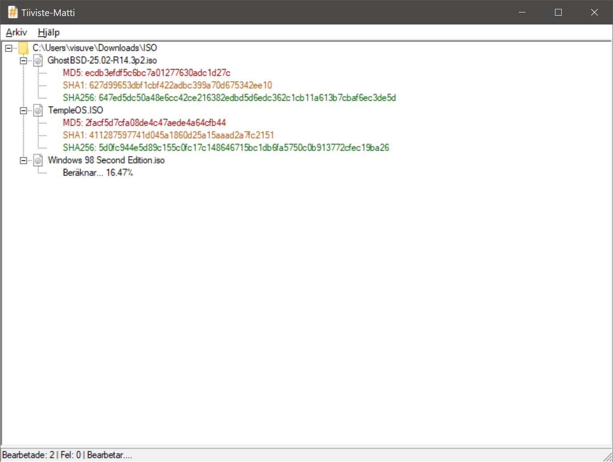

# Tiiviste-Matti

Native Windows desktop applications demonstrating high-performance file hashing using only Win32, C++ standard libraries and Microsoft Cryptography API: Next Generation (CNG).
- Reference: https://docs.microsoft.com/en-us/windows/win32/seccng/cng-portal

	
	 
	<b><i>Tiiviste-Matti GUI</i></b>

## Project folder structure
- [TiivisteMattiGUI](TiivisteMattiGUI/) hash calculator with native graphical user interface
- [TiivisteMattiCLI](TiivisteMattiCLI/) hash calculator for command-line use 
- [TiivisteMattiLib](TiivisteMattiLib/) shared library with core hashing logic used by both GUI and CLI
- [TiivisteMattiTests](TiivisteMattiTests/) unit tests for hashing functions and utilities

## Build prerequisites

- Visual Studio 2022
  - https://www.visualstudio.com/
  - C++ Desktop Development Workload selected

## Build instructions

1. Open `TiivisteMatti.sln` in Visual Studio 2022.
2. Select target architecture (x64 recommended) and configuration (Release/Debug).
3. Build Solution (`Ctrl+Shift+B`).

*Note: When building locally, the Git commit hash in the About dialog defaults to a local fallback. Official release binaries built via GitHub Actions automatically receive the exact commit SHA.*